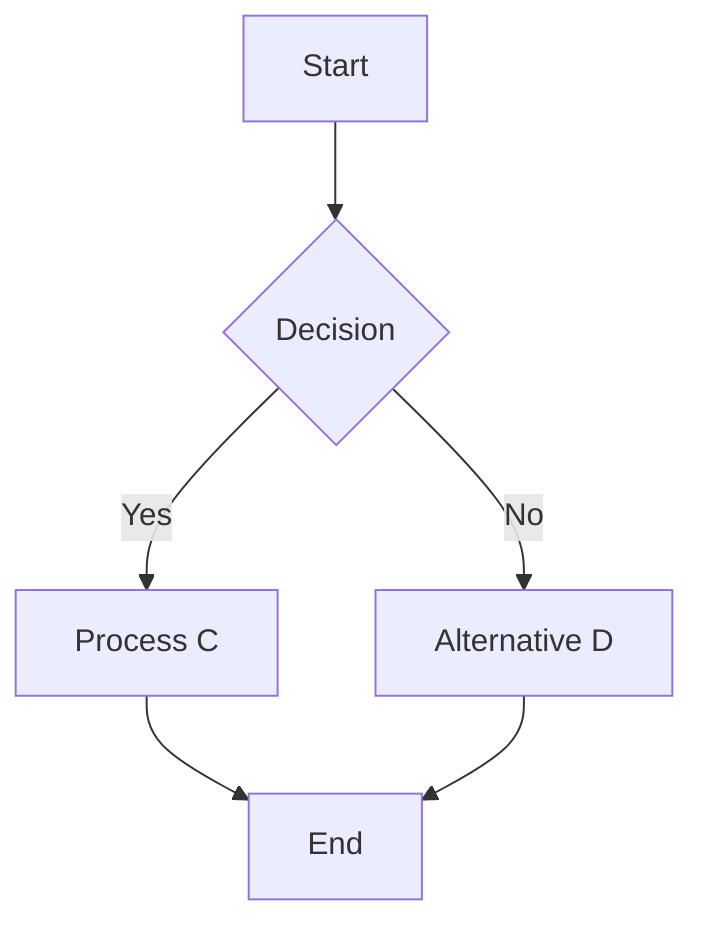
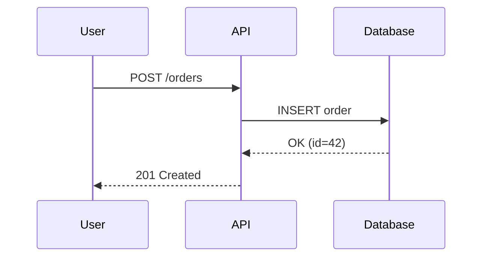
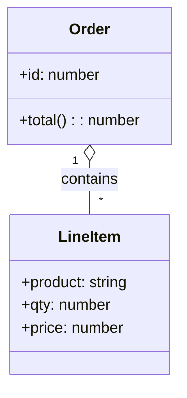
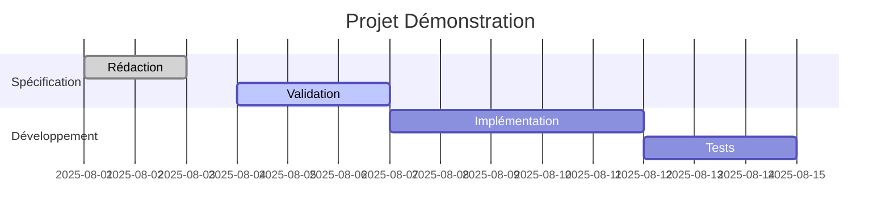

# Document de test: Conversion Markdown → DOCX

Ce document vise à tester la conversion complète, y compris:

- Table des matières automatique
- Liens internes et externes
- Listes imbriquées (puces et numérotées)
- Tableaux avec formatage inline
- Blocs de code
- 4 types de graphiques Mermaid

## Sommaire

- [Document de test: Conversion Markdown → DOCX](#document-de-test-conversion-markdown--docx)
  - [Sommaire](#sommaire)
  - [Introduction](#introduction)
    - [Niveaux de titres](#niveaux-de-titres)
      - [Niveau 4](#niveau-4)
  - [Listes et formats](#listes-et-formats)
  - [Tableau de données](#tableau-de-données)
  - [Code et citations](#code-et-citations)
  - [Graphiques Mermaid](#graphiques-mermaid)
    - [Flowchart](#flowchart)
    - [Sequence Diagram](#sequence-diagram)
    - [Class Diagram](#class-diagram)
    - [Gantt Diagram](#gantt-diagram)
  - [Conclusion](#conclusion)

---

## Introduction

Ce document contient du texte avec du **gras**, de l'*italique*, du `code inline` et un [lien externe](https://example.com). Il inclut aussi des références internes comme aller à la section [Tableau de données](#tableau-de-donnees).

### Niveaux de titres

#### Niveau 4

Ce paragraphe valide les styles de titres multiples.

---

## Listes et formats

Liste à puces:

- Élément 1
  - Sous-élément 1.1 avec du **gras**
  - Sous-élément 1.2 avec de l'*italique* et du `code`
- Élément 2 avec un [lien relatif](#conclusion)
- Élément 3

Liste numérotée imbriquée:

1. Premier
2. Deuxième
   1. Deuxième.1
   2. Deuxième.2 avec `code` et **formatage**
3. Troisième

Liste de tâches:

- [x] Spécification
- [ ] Implémentation
- [ ] Revue

---

## Tableau de données

| Produit  | Qté | Prix | Remarques             |
|----------|:---:|-----:|-----------------------|
| Pommes   |  3  | 1,20 | Prix au kilo          |
| Bananes  |  5  | 0,80 | Promo: **-10%**       |
| Kiwis    |  8  | 2,40 | Voir note *saison*    |
| Total    |     | 4,40 | Inclut remise `-0,20` |

Texte après tableau pour vérifier l’espacement.

---

## Code et citations

> Ceci est une citation avec du texte et un mot en **gras**.

Bloc de code:

```ts
function total(prices: number[]): number {
  return prices.reduce((a, b) => a + b, 0);
}

console.log(total([1.2, 0.8, 2.4]));
```

---

## Graphiques Mermaid

### Flowchart



### Sequence Diagram



### Class Diagram



### Gantt Diagram



---

## Conclusion

Ce document couvre une large variété d’éléments Markdown pour valider la conversion vers DOCX, y compris 4 types de graphes Mermaid.
